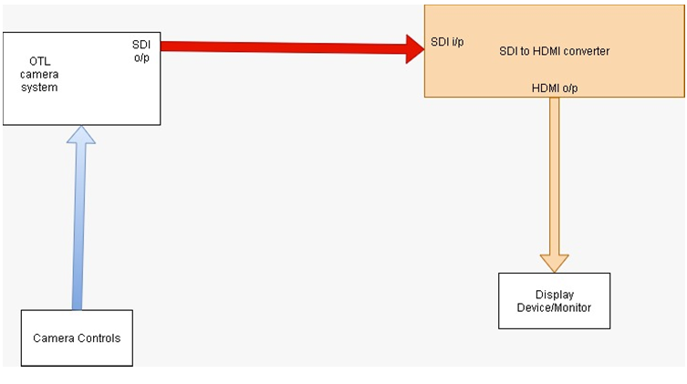

# Eclipse-Instrumentation
Elipse Instrumentation Private Limited

This is all the report plus diaries combined for coursework done during PS-1 from May 2020-June 2020.

Worked on a project which aimed to find the best technology for camera in Operation Theatre used in Surgery and making them wireless so that it could increase their efficiency as well as minimize the space. Worked on OFDM technology to improve wireless video transmission.

